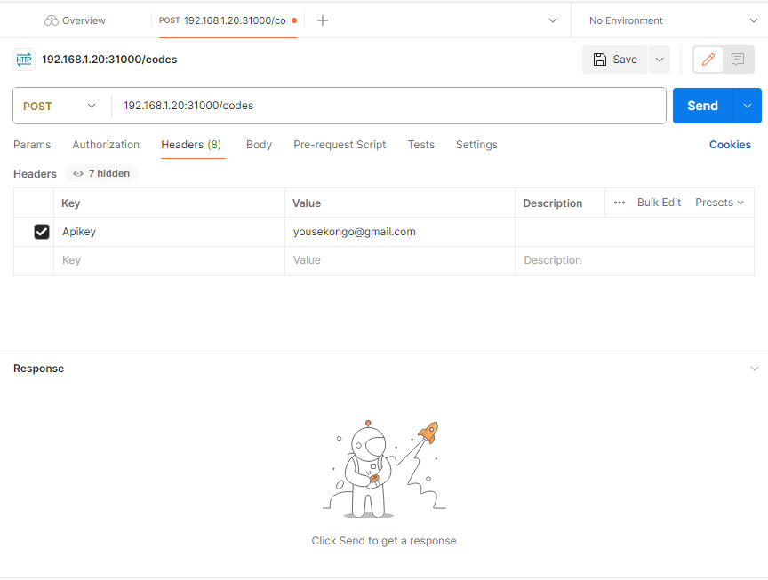
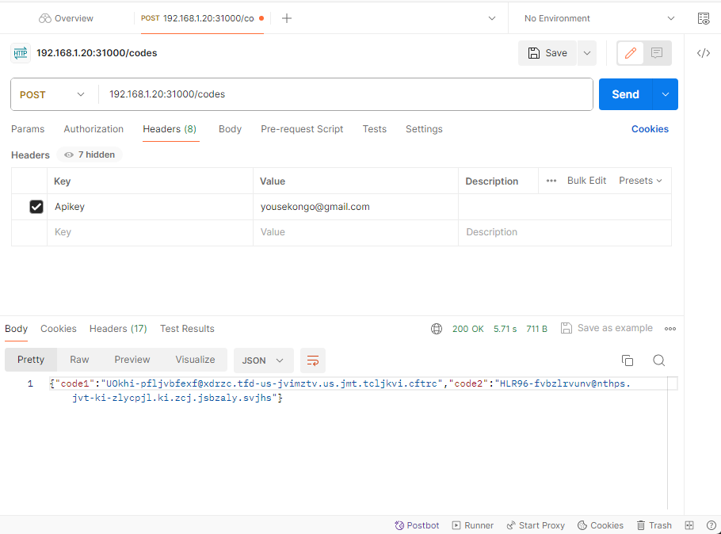

# kubechallenge

Ce lab a été réalisé sous Minikube version `v1.32.0`. 

## Présentation 

OS : Windows 11 \
L'objectif est de récupérer des codes de validations en effectuant une requete POST sur le path `/codes` de l'application `App` an ayant au préalable provisionné un cluster

## Créations du cluster

### Prérequis
2 CPUs ou plus\
2GB de mémoire RAM disponible\
20GB de stockage disponible\
Un gestionnaire de conteneur ou de VM comme Virtualbox, Hyper-V, docker...

### Installation de la distribution légère de k8s [minikube]
Pour cet exercice, j'utilise : \
`Docker` : Pilote de minikube.\
`Chocolatey` : Gestionnaire de packages.\
`minikube` : Distribution légère de K8s.\
Le binaire de minikube est disponible sur le [site](https://minikube.sigs.k8s.io/docs/start/). J’effectue la récupération et l'installation de minikube avec la commande suivante : \
`choco install -y minikube`

### Provisionnement du cluster et création des fichiers manifeste YAML
Le démarrage du cluster se fait à travers la commande : \
`minikube start --driver docker –-nodes 2 –subnet 192.168.51.0`\
`--driver` : Indique le pilote utilisé par minikube; `--driver driver` peut etre ignorée car par défaut l'option driver est définie sur docker.
`–-nodes` : Specifie le nombre de nœuds utilisé pour le cluster. Dans notre cas 2 nœuds soit le master et un worker.
Le provisionnement de notre cluster se fera par les différentes étapes suivantes.\

#### Création des namespaces

La commande : `kubectl create namespace db` pour la création du namespace `db`.\
Et la commande : `kubectl create namespace app` pour la création du namespace `app`.

#### Création d'un volume persistant(PersistentVolume)

Le volume persistant est un espace de stockage approprié pour les applications stateful. En d'autres termes qui doivent conserver leurs états ou les données même après le redémarrage des pods sur lesquels ils sont exécutés. 

```yaml
apiVersion: v1
kind: PersistentVolume
metadata:
  name: disk-pv
spec:
  capacity:
    storage: 2Gi
  accessModes:
    - ReadWriteOnce
  hostPath:
    path: "F:\\Data" #windows
    type: DirectoryOrCreate
```
##### Explication
```yaml 
capacity:
    storage: 2Gi
```    
Définit l'espace total alloué au volume persistant. 2 giga dans notre cas.

```yaml
  accessModes:
    - ReadWriteOnce
```
Indique volume ne peut uniquement être monté qu’en lecture-écriture par ==un seul== nœud.

```yaml
  hostPath:
    path: "F:\\Data" #windows
    type: DirectoryOrCreate
```
Le PV est de type hostpath, c'est à dire qu'il met à la disposition du cluster un chemin (le chemin F:\Data) de la machine hôte. Ce répertoire est créé s'il n'existe pas.

La création du volume persistant s'effectue avec la commande: \
`kubectl create -f files/hostpath-pv.yml`.
Avec :
`-f` : l'utilisation d'un fichier en argument
`files/hostpath-pv.yml` le chemin relatif du fichier yaml.

#### Création sur le namespace `db` du service chargé de la statefulset 

```yaml
apiVersion: v1
kind: Service
metadata:
  name: db-service
  namespace: db
spec:
  type: ClusterIP
  selector:
    app: postgres
  ports:
  - port: 5432
    targetPort: 5432
```
Ensuite la commande : `kubectl create -f files/db-svc.yml` pour la création de l'objet
##### Explication
`type: ClusterIP`: attribue une adresse IP interne au service
```yaml 
  selector:
    app: postgres
```    
Achemine le trafic vers tous les pods ayant pour label `app: postgres`.
```yaml 
ports:
  - port: 5432
    targetPort: 5432
```   
Mappe le port `port` du service au port `targetPort` du pod.


#### Création du secret sur le namespace `db`
Ce secret permettra de stocker les informations le mot de passe utilisés par le serveur postgres.
```yaml
apiVersion: v1
kind: Secret
metadata:
  name: pg-password
  namespace: db
type: Opaque
data:
  password: cG9zdGdyZXMK
```
`password: cG9zdGdyZXMK` est le hash en base64 du mot de passe.\
Ensuite la commande : `kubectl create -f files/db-pg-password-secret.yml` pour la création de l'objet

#### Création du statefulset sur le namespace `db`

```yaml
apiVersion: apps/v1
kind: StatefulSet
metadata:
  name: postgres-statefulset
  namespace: db
spec:
  selector:
    matchLabels:
      app: postgres
  serviceName: db-service
  template:
    metadata:
      labels:
        app: postgres
    spec:
      containers:
      - name: postgres
        image: postgres:14-alpine
        env:
        - name: POSTGRES_PASSWORD
          valueFrom:
            secretKeyRef:
              name: pg-password
              key: password
        ports:
        - containerPort: 5432
          name: db
        imagePullPolicy: IfNotPresent
        volumeMounts:
        - name: db-pvc
          mountPath: /var/lib/postgresql/data
  volumeClaimTemplates:
  - metadata:
      name: db-pvc
    spec:
      accessModes: [ "ReadWriteOnce" ]
      resources:
        requests:
          storage: 1Gi
```
Ensuite la commande : `kubectl create -f files/db-statefulset.yml` pour la création du statefulset

##### Explication
...

#### Création de la base de données à l'intérieur du statefulset
La création de la base de données utilisée par l'application `app-test` peut se faire en envoyant une commande `createdb -U postgres appdb ` au service `db-service` qui l'acheminera vers le statefulset. Cela consiste à exécuter la commande : `kubectl exec -ti service/db-service -n db -- createdb -U postgres appdb`\
`exec` : Exécute un shell dans le pod.\
`-t` : Entrée standard de type TTY.\
`-i` : Passer l'entrée standard au conteneur.\
`-n db` : Spécifie-le `db` namespace à utiliser.\
`--` ou `--commands` : Accepte les commandes à envoyer sur l'entrée standard.\

Pour ma part j'utilise un job Kubernetes qui utilise le `secret` `pg-password` définies plus haut

```yaml
apiVersion: batch/v1
kind: Job
metadata:
  name: create-pgdb-job
  namespace: db
spec:
  ttlSecondsAfterFinished: 100
  template:
    spec:
      containers:
      - name: app-db
        image: postgres:14-alpine
        command: ["createdb"]
        args: ["-h","db-service.db.svc.cluster.local", "-U", postgres, "appdb" ]
        env:
        - name: PGPASSWORD
          value: postgres
      restartPolicy: Never
```
Ensuite la commande : `kubectl create -f files/create-pgdb-job.yml` pour la création de l'objet
##### Explication
...


#### Création d'une ConfigMap pour l'application `app-test` sur le namespace `app`
Cette configMap permet de stocker les variables d'environnement qui seront définies au demarrage de l'application `app-test`.\
```yaml
apiVersion: v1
kind: ConfigMap
metadata:
  name: db-vars-for-app
  namespace: app
data:
  POSTGRES_DB: appdb
  POSTGRES_HOST: db-service.db.svc.cluster.local
  POSTGRES_PORT: "5432"
  POSTGRES_USER: postgres
  POSTGRES_PASSWORD: postgres
```
Ensuite la commande : `kubectl create -f files/app-env-bars-cm.yml` pour la création de l'objet.

##### Explication
...


#### Création du déploiement de l'appli `app-test` sur le namespace `app`

```yaml
apiVersion: apps/v1
kind: Deployment
metadata:
  name: app-test
  namespace: app
spec:
  selector:
    matchLabels:
      app: app-test
  template:
    metadata:
      labels:
        app: app-test
    spec:
      containers:
      - name: app-test
        image: system.registry.eneci.net/app-test
        envFrom:
        - configMapRef:
            name: db-vars-for-app
        imagePullPolicy: IfNotPresent
        resources:
          limits:
            memory: "128Mi"
            cpu: "500m"
        ports:
        - containerPort: 8080
      imagePullSecrets:
      - name: private-reg-secret
```
Ensuite la commande : `kubectl create -f files/app-deploy.yml` pour la création de l'objet
##### Explication
Voir section [Récupération de l'image app-test du référentiel docker privé](#Récupération) 
...

#### Création du service de l'appli `app-test` sur le namespace `app`
Ce service permet d'accéder au déploiement de l'application sans se soucier des adresses IP des pods.

```yaml
apiVersion: v1
kind: Service
metadata:
  name: app-service
  namespace: app
spec:
  type: NodePort
  selector:
    app: app-test
  ports:
  - port: 8080  
    targetPort: 8080
    nodePort: 30001

```
Ensuite la commande : `kubectl create -f files/app-svc.yml` pour la création de l'objet
##### Explication
...


## Récupération de l'image app-test du référentiel docker privé
Pour récupérer une image d'un référentiel docker privé depuis k8s, il faut au préalable définir un `secret` de type `docker-registry` qui contiendra les informations de connexion du dépôt privé. \
On pourra procéder comme suit: \
`kubectl create secret docker-registry private-reg-secret --docker-server=system.registry.eneci.net --docker-username=data354test --docker-password=2jYdk3G9`. \

Ce secret est ensuite utilisé dans la définition du déploiement de l'application avec la clé `imagePullSecrets.name`
```yaml
template:
    metadata:
      labels:
        app: app-test
    spec:
      containers:
      - name: app-test
        image: system.registry.eneci.net/app-test
        envFrom:
        - configMapRef:
            name: db-vars-for-app
        imagePullPolicy: IfNotPresent
        resources:
          limits:
            memory: "128Mi"
            cpu: "500m"
        ports:
        - containerPort: 8080
      imagePullSecrets:
      - name: private-reg-secret
```


## Modification du fichier /app/data/mail.txt

La modification du fichier /app/data/mail.txt se fait en envoyant la commande `echo yousekongo@gmail.com > /app/data/mail.txt` au service `app-service` qui l'acheminera vers le deployment `app-test`.\
En pratique cela revient à se connecter au shell de l'application avec la commande : `kubectl exec -ti service/app-service -n app -- sh` et ensuite exécuter la commande `echo yousekongo@gmail.com > /app/data/mail.txt`\
`exec` : Exécute un shell dans le pod.\
`-i` : Passer l'entrée standard au pod.\
`-t` : Entrée standard de type TTY.\
`-n app` : Spécifie le `app` namespace à utiliser.\
`--` ou `--commands` Accepte les commandes à envoyer sur l'entrée standard.\

On peut vérifier que le fichier est bien modifié avec la commande `cat /app/data/mail.txt`
```code
/app # cat /app/data/mail.txt
yousekongo@gmail.com
```
## Communication avec l'application depuis l'extérieur du cluster

Pour établir la communication avec le cluster depuis la machine hôte, j'utilise le `port-forward` qui permet de lier un port de la machine hôte au port d'un pod. Concrètement, cela se fait à partir de la commande : \ 
`kubectl port-forward service/app-service -n app 31000:8080 --address 192.168.1.20`.\
Ainsi on transfère sur le port 31000 de l'adresse 192.168.1.20 (qui correspond à l'adresse de la machine hôte dans un LAN), tout le trafic du service `app-service` sachant que celui-ci gère directement le déploiement de l’application `app-test`.


## Requête du client REST et réponse
Pour l'envoi de la requête REST, j'utilise `Postman`.
### Requête
Une requête `POST`, avec dans le header la clé-valeur `Apikey:yousekongo@gmail.com` est adressée à l'url `192.168.1.20:31000`. 

### Réponse
La réponse obtenue est la suivante: \
```json
{
    "code1": "UOkhi-pfljvbfexf@xdrzc.tfd-us-jvimztv.us.jmt.tcljkvi.cftrc",
    "code2": "HLR96-fvbzlrvunv@nthps.jvt-ki-zlycpjl.ki.zcj.jsbzaly.svjhs"
}
```



## Auteur 
Youssoufou SEKONGO
yousekongo@gmail.com
